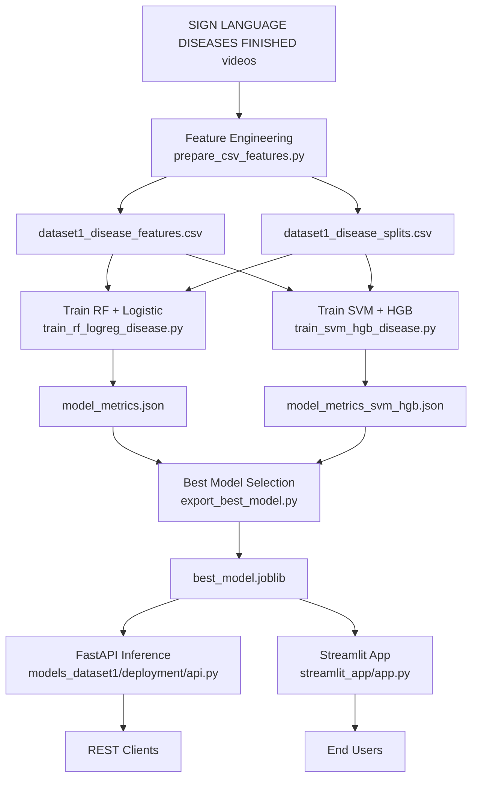

 Uganda Sign Language Instructor


An end-to-end machine learning project for Uganda Sign Language (USL) recognition, focused on disease-related signs, model training, deployment, and interactive demo delivery.

This repository combines:

- dataset analysis and feature engineering,
- supervised model training and selection,
- FastAPI deployment for inference,
- Docker and PowerShell operational workflows,
- Streamlit interface for practical usage.

 Project Scope

The project is organized around two complementary goals:

1. Disease-sign classification pipeline (Dataset 1 style workflow)

- Build tabular features from sign language videos.
- Train and compare multiple classifiers.
- Export the best model artifact for deployment.
- Serve predictions through a production-ready API.

2. Interactive USL demonstration workflow (Streamlit)

- Support image, video, and webcam-style input paths.
- Run lightweight feature extraction for inference.
- Provide top-k predictions and confidence outputs.

 System Architecture



 Model Benchmarks

Benchmarks below are sourced from the repository artifacts:

- `models_dataset1/csv_models/artifacts/model_metrics.json`
- `models_dataset1/csv_models/artifacts/model_metrics_svm_hgb.json`

| Model                | Validation Accuracy | Validation Macro-F1 | Test Accuracy | Test Macro-F1 |
| -------------------- | ------------------: | ------------------: | ------------: | ------------: |
| Random Forest        |              0.9107 |              0.8819 |        0.8393 |        0.7909 |
| Logistic Regression  |              0.8571 |              0.8552 |        0.8571 |        0.8054 |
| SVM (RBF)            |              0.8929 |              0.8889 |        0.8750 |        0.8388 |
| HistGradientBoosting |              0.8036 |              0.7445 |        0.8214 |        0.7376 |

Current best flat model by test accuracy: **SVM (RBF)** with **0.8750** test accuracy and **0.8388** test macro-F1.

 Repository Structure

```text
.
├── analysis/
│   ├── eda_dataset1.py
│   └── eda_dataset2.py
├── DATASET_ug_sign_language/
│   ├── sign_annotations.csv
│   ├── videos/
│   ├── Keypoints/
│   └── features/
├── models_dataset1/
│   ├── csv_models/
│   │   ├── prepare_csv_features.py
│   │   ├── train_rf_logreg_disease.py
│   │   ├── train_svm_hgb_disease.py
│   │   ├── export_best_model.py
│   │   ├── generate_learning_curves.py
│   │   └── xai_audit_four_models.py
│   ├── deployment/
│   │   ├── api.py
│   │   ├── Dockerfile
│   │   ├── requirements.txt
│   │   └── DEPLOYMENT.md
│   └── shared/
├── outputs/
│   ├── eda_dataset1/
│   └── eda_dataset2/
├── scripts/
│   ├── mlops_shortcuts.ps1
│   ├── start_usl_api.ps1
│   └── manage_usl_api_service.ps1
├── SIGN LANGUAGE DISEASES FINISHED/
├── streamlit_app/
│   ├── app.py
│   ├── train_keypoint_model.py
│   ├── requirements.txt
│   └── README.md
├── docker-compose.yml
├── test_env.py
└── test_pose_extraction.py
```

 Core Components

 Feature Engineering and Data Preparation

Primary script:

- `models_dataset1/csv_models/prepare_csv_features.py`

What it does:

- scans disease-category video folders,
- computes metadata and visual/statistical descriptors,
- optionally uses MediaPipe Holistic when available,
- writes feature and split artifacts:
  - `dataset1_disease_features.csv`
  - `dataset1_disease_splits.csv`

 2) Model Training and Comparison

Primary scripts:

- `models_dataset1/csv_models/train_rf_logreg_disease.py`
- `models_dataset1/csv_models/train_svm_hgb_disease.py`

Models covered:

- Random Forest
- Logistic Regression (with scaling)
- SVM (RBF)
- HistGradientBoosting

Training characteristics:

- stratified train/val/test split usage,
- Gaussian noise augmentation for training set expansion,
- confusion matrix export,
- metrics serialization for model selection.

 3) Best Model Export

Primary script:

- `models_dataset1/csv_models/export_best_model.py`

What it does:

- loads metrics from all trained models,
- selects the best model by target metric (default: test accuracy),
- retrains on train+val,
- writes deployment artifact:
  - `models_dataset1/csv_models/artifacts/best_model.joblib`

 4) API Deployment (FastAPI)

Primary module:

- `models_dataset1/deployment/api.py`

Key features:

- startup model loading from artifact,
- optional API-key auth via `x-api-key`,
- health endpoints (`/health`, `/live`, `/ready`),
- prediction endpoint (`/predict`) with top-k response,
- request logging with request-id propagation.

 5) Streamlit App

Primary module:

- `streamlit_app/app.py`

Supports:

- image uploads,
- video uploads,
- camera input,
- top-k predictions and confidence reporting.

Model path behavior:

- prefers local `streamlit_app/model.pkl`,
- falls back to exported model artifact from `models_dataset1/csv_models/artifacts/best_model.joblib`.

 Data Assets

 Dataset Group 1

- `SIGN LANGUAGE DISEASES FINISHED/`
- disease-centered class folders used by tabular feature/training workflow.

 Dataset Group 2

- `DATASET_ug_sign_language/`
- contains annotation CSV, videos, keypoints, and feature arrays.

EDA scripts for both are available in `analysis/` and save outputs in `outputs/`.

 Quick Start

 1) Environment

Use Python 3.10+ (3.11 recommended), then create and activate your virtual environment.

Windows PowerShell:

```powershell
python -m venv .venv
.\.venv\Scripts\Activate.ps1
```
 2) Install dependencies

For API/training workflow:

```powershell
python -m pip install --upgrade pip
python -m pip install -r models_dataset1/deployment/requirements.txt
python -m pip install pandas matplotlib seaborn opencv-python mediapipe
```

For Streamlit app:

```powershell
python -m pip install -r streamlit_app/requirements.txt
```

 3) Build feature artifacts

```powershell
python models_dataset1/csv_models/prepare_csv_features.py
```

 4) Train model families

```powershell
python models_dataset1/csv_models/train_rf_logreg_disease.py
python models_dataset1/csv_models/train_svm_hgb_disease.py
```

 5) Export best model

```powershell
python models_dataset1/csv_models/export_best_model.py --metric test_accuracy --augment
```

 6) Run FastAPI locally

```powershell
$env:API_KEY="change-me"
python -m uvicorn models_dataset1.deployment.api:app --host 0.0.0.0 --port 8000
```

Health checks:

- `GET http://localhost:8000/health`
- `GET http://localhost:8000/live`
- `GET http://localhost:8000/ready`

 7) Run Streamlit demo

```powershell
streamlit run streamlit_app/app.py
```

 Docker and Compose

Build and run with Docker Compose:

```powershell
docker compose up -d --build
```

Stop:

```powershell
docker compose down
```

Compose file:

- `docker-compose.yml`

 PowerShell Operations Shortcuts

Script:

- `scripts/mlops_shortcuts.ps1`

Examples:

```powershell
# export best model artifact
.\scripts\mlops_shortcuts.ps1 -Action export

# run API
.\scripts\mlops_shortcuts.ps1 -Action serve -ApiKey "change-me" -Port 8000

# API health check
.\scripts\mlops_shortcuts.ps1 -Action health -Port 8000

# local prediction smoke test
.\scripts\mlops_shortcuts.ps1 -Action predict-smoke -ApiKey "change-me" -Port 8000

# local CI-style checks
.\scripts\mlops_shortcuts.ps1 -Action ci-local
```

Windows Service Operations

Service manager:

- `scripts/manage_usl_api_service.ps1`

Typical lifecycle (PowerShell as Administrator):

```powershell
.\scripts\manage_usl_api_service.ps1 -Action install -ApiKey "change-me" -Port 8000
.\scripts\manage_usl_api_service.ps1 -Action start
.\scripts\manage_usl_api_service.ps1 -Action status
.\scripts\manage_usl_api_service.ps1 -Action stop
.\scripts\manage_usl_api_service.ps1 -Action remove
```

Testing and Validation Utilities

- `test_env.py` for quick package/runtime checks.
- `test_pose_extraction.py` for pose extraction sanity testing.
- `.github/workflows/ml-api-ci.yml` for CI validation, API smoke tests, and container readiness checks.

Outputs and Artifacts

Common output locations:

- `models_dataset1/csv_models/artifacts/` for features, metrics, confusion matrices, and deployment artifacts.
- `outputs/eda_dataset1/` and `outputs/eda_dataset2/` for EDA figures and reports.

Intended Use

This project is intended for:

- machine learning experimentation and benchmarking for USL,
- deployment-oriented model serving workflows,
- educational and demonstration interfaces for sign recognition scenarios.
 Notes

- Keep model artifacts versioned or archived before retraining to preserve reproducibility.
- For production usage, place API behind TLS and gateway-level rate limiting.
- If an API key is configured, clients must supply `x-api-key` for `/predict`.
Author

Umar Mubiru

License

No license file is currently defined in this repository.

If you want, this README can be further customized for public GitHub presentation with badges, architecture diagrams, benchmark tables, and a contributor section.
